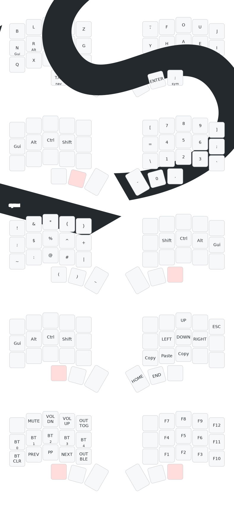

# Temper ZMK Config

This is my personal ZMK config for the [temper](https://github.com/raeedcho/temper).

Some notes about this config:
- Three main layers (default, numbers/symbols, and function)
- Default layer is Graphite

